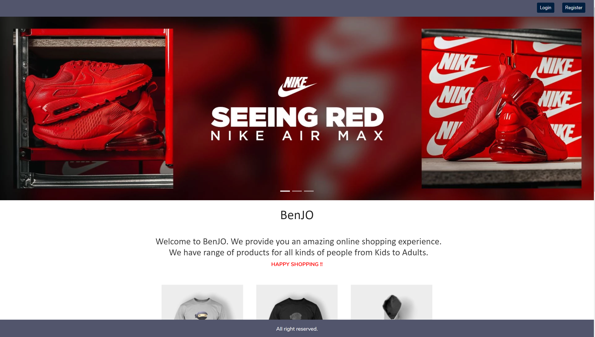

# BenJO ecommerce website  

BenJO is an online shopping website where you can find amazing products with great quality and price. We have range of products for all kinds of people from Kids to Adults.

## Link to Application

Follow [this link](https://frozen-brushlands-62997.herokuapp.com/) to view the application.

## Screenshots

### Desktop

## How to set up this repo:
1. clone this repository
2. run mongod
3. run `npm install`
4. run `npm start`

## Built With

- HTML5, CSS3, MERN

## Contributing

Please read [CONTRIBUTING.md]() for details on the code of conduct, and the process for submitting pull requests.

## Authors

- **Prakriti Rajbhandari** - [PrakritiRajbhandari](https://github.com/PrakritiRajbhandari)

## License

This project is licensed under the MIT License - see the [LICENSE.txt](https://github.com/yours-kkuznets/Random-Password-Generator/blob/master/LICENSE.txt) file for details

## Acknowledgments

- Billie Thompson - [PurpleBooth](https://gist.github.com/PurpleBooth) - [README.md](https://gist.github.com/PurpleBooth/109311bb0361f32d87a2) and [CONTRIBUTING.md](https://gist.github.com/PurpleBooth/b24679402957c63ec426) templates.

